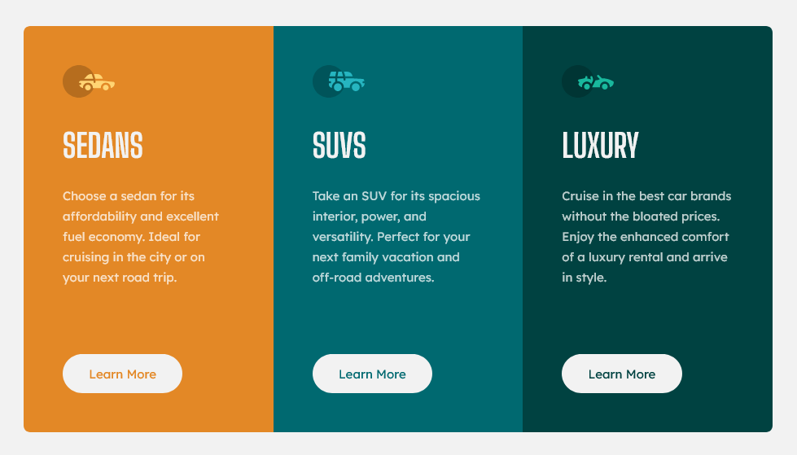

# Frontend Mentor - 3-column preview card component solution

This is a solution to the [3-column preview card component challenge on Frontend Mentor](https://www.frontendmentor.io/challenges/3column-preview-card-component-pH92eAR2-). Frontend Mentor challenges help you improve your coding skills by building realistic projects. 

## Table of contents

- [Frontend Mentor - 3-column preview card component solution](#frontend-mentor---3-column-preview-card-component-solution)
  - [Table of contents](#table-of-contents)
  - [Overview](#overview)
    - [The challenge](#the-challenge)
    - [Screenshot](#screenshot)
    - [Links](#links)
  - [My process](#my-process)
    - [Built with](#built-with)
    - [What I learned](#what-i-learned)
    - [Useful resources](#useful-resources)
  - [Author](#author)

## Overview

### The challenge

Users should be able to:

- View the optimal layout depending on their device's screen size
- See hover states for interactive elements

### Screenshot



### Links

- Solution URL: [https://github.com/adamwozhere/frontend-mentor-challenges/tree/main/3-column-preview-card-component/](https://github.com/adamwozhere/frontend-mentor-challenges/tree/main/3-column-preview-card-component/)
- Live Site URL: [https://adamwozhere.github.io/frontend-mentor-challenges/3-column-preview-card-component/](https://adamwozhere.github.io/frontend-mentor-challenges/3-column-preview-card-component/)

## My process

I used the CUBE CSS methodology to create this component as a way to get more familiar with the cascade and inheritence. I'm surprised by how flexible the methodology is; I didn't fall too heavily on the utility classes (using them mainly for container classes and background-colours) and it still allows for compartmentalising a component as with the BEM methodology.

### Built with

- Semantic HTML5 markup
- CSS custom properties
- Flexbox
- CSS Grid
- Mobile-first workflow
- No media queries!
- [CUBE CSS](https://cube.fyi/) - CSS methodology

### What I learned

For this project I looked into a way of not using media queries at all. I managed to create a container class that would handle going from a 3-column layout directly to a 3-row layout without any wrapping as you would get with flexbox. (helpful articles listed in the 'Useful Resources' section below.)

I used css custom properties to make using the container easier as the code is a bit unsightly. Essentially I define a container that can only have 3 items in a row OR 3 items in a column. The container has a breakpoint variable for when the state changes between the two, and has two max-widths; one max-width for when in column layout, and one when in row layout:

```css
/* switches between a horizontal and vertical layout without wrapping */
.switch-stack {
    /* var(--breakpoint): vertical/horizontal switch breakpoint */
    /* var(--max-vertical-width): max-width when in vertical layout */
    
    margin-inline: auto;
    max-width: 100%; /* prevent horizontal overflow */

    /* limits widths for column and row layouts */
    width:
        clamp(
            var(--max-width-column, 100%), /* min value */
            (100% - var(--breakpoint, 40rem)) * 999, /* preferred value */
            var(--max-width-row) /* maximum value */
        ); 

    /* displays only 3 in a row if enough space, otherwise in a column */
    display: grid;
    grid-template-columns: 
        repeat(
            auto-fit,
            minmax(
                clamp(
                    33.333%, /* min value */
                    (var(--breakpoint, 40rem) - 100%) * 999, /* preferred value */
                    100% /* max value */
                ),
                1fr
            )
        );
}
```
Both `.switch-stack` and `.preview-card` classes are applied to the container, with `.preview-card` defining the widths and breakpoints etc.
```css
.preview-card {
    border-radius: 0.5rem;
    overflow: hidden;
    
    min-height: 31.2rem;
    --breakpoint: 51.25rem;
    --max-width-column: 26.25rem;
    --max-width-row: 57.5rem;

}
```

### Useful resources

- [CUBE CSS](https://www.cube.fyi) - CSS methodology that works well with the cascade and with tokens but also with a more compartmentalised approach suach as with BEM.
- [Flexbox Albatros](https://heydonworks.com/article/the-flexbox-holy-albatross/) - This article looks at a way of switching from a horizontal layout to a vertical one without having any wrapping.
- [Flexible layouts without media queries](https://blog.logrocket.com/flexible-layouts-without-media-queries/) - This helped me to understand the 'flexbox albatros' better and helped with example code that I used in this implementation.

## Author

- Website - [Adam Wozniak](https://www.adamwozniak.uk)
- Frontend Mentor - [@adamwozhere](https://www.frontendmentor.io/profile/adamwozhere)

