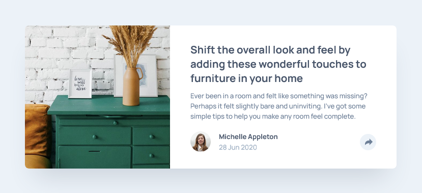

# Frontend Mentor - Article preview component solution

This is a solution to the [Article preview component challenge on Frontend Mentor](https://www.frontendmentor.io/challenges/article-preview-component-dYBN_pYFT). Frontend Mentor challenges help you improve your coding skills by building realistic projects. 

## Table of contents

- [Frontend Mentor - Article preview component solution](#frontend-mentor---article-preview-component-solution)
  - [Table of contents](#table-of-contents)
  - [Overview](#overview)
    - [The challenge](#the-challenge)
    - [Screenshot](#screenshot)
    - [Links](#links)
  - [My process](#my-process)
    - [Built with](#built-with)
    - [What I learned](#what-i-learned)
  - [Author](#author)

**Note: Delete this note and update the table of contents based on what sections you keep.**

## Overview

### The challenge

Users should be able to:

- View the optimal layout for the component depending on their device's screen size
- See the social media share links when they click the share icon

### Screenshot

### Links

- Solution URL: [https://github.com/adamwozhere/frontend-mentor-challenges/tree/main/article-preview-component/](https://github.com/adamwozhere/frontend-mentor-challenges/tree/main/article-preview-component/)
- Live Site URL: [https://adamwozhere.github.io/frontend-mentor-challenges/article-preview-component/](https://adamwozhere.github.io/frontend-mentor-challenges/article-preview-component/)

## My process

### Built with

- Semantic HTML5 markup
- CSS custom properties
- Flexbox
- CSS Grid
- Mobile-first workflow
- Accessibility
- BEM

### What I learned

I learned more about relative / absolute positioning in this project as well as putting javascript knowledge into practice. I found it quite difficult at first because the two different styles of pop-up: in the mobile version it slides up and is hidden by the card; `overflow: hidden` solves this, but then for the desktop view the pop-up gets clipped at the right hand edge of the card. I'm not sure if there is a better option but I solved this by switching overflow on the card back to visible, and rounding the corners and hiding the overflow on the media-box image container when in the desktop view instead; that way the card can keep the appearance of rounded corners but the popup will still be fully visible without clipping to the edge of the card container.

## Author

- Website - [Adam Wozniak](https://www.adamwozniak.uk)
- Frontend Mentor - [@adamwozhere](https://www.frontendmentor.io/profile/adamwozhere)
