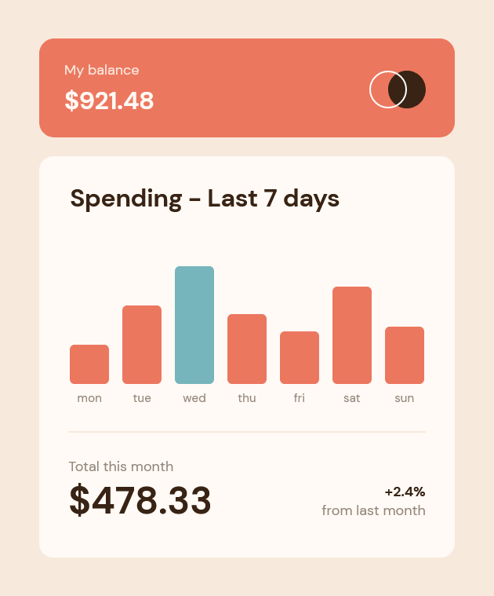

# Frontend Mentor - Expenses chart component solution

This is a solution to the [Expenses chart component challenge on Frontend Mentor](https://www.frontendmentor.io/challenges/expenses-chart-component-e7yJBUdjwt). Frontend Mentor challenges help you improve your coding skills by building realistic projects. 

## Table of contents

- [Frontend Mentor - Expenses chart component solution](#frontend-mentor---expenses-chart-component-solution)
  - [Table of contents](#table-of-contents)
  - [Overview](#overview)
    - [The challenge](#the-challenge)
    - [Screenshot](#screenshot)
    - [Links](#links)
  - [My process](#my-process)
    - [Built with](#built-with)
    - [What I learned](#what-i-learned)
    - [Useful resources](#useful-resources)
  - [Author](#author)

**Note: Delete this note and update the table of contents based on what sections you keep.**

## Overview

### The challenge

Users should be able to:

- View the bar chart and hover over the individual bars to see the correct amounts for each day
- See the current day’s bar highlighted in a different colour to the other bars
- View the optimal layout for the content depending on their device’s screen size
- See hover states for all interactive elements on the page
- **Bonus**: Use the JSON data file provided to dynamically size the bars on the chart

### Screenshot

### Links

- Solution URL: [https://github.com/adamwozhere/frontend-mentor-challenges/tree/main/expenses-chart-component/](https://github.com/adamwozhere/frontend-mentor-challenges/tree/main/expenses-chart-component/)
- Live Site URL: [https://adamwozhere.github.io/frontend-mentor-challenges/expenses-chart-component/](https://adamwozhere.github.io/frontend-mentor-challenges/expenses-chart-component/)

## My process

### Built with

- Semantic HTML5 markup
- CSS custom properties
- Flexbox
- Mobile-first workflow
- Dynamic page (with JSON)

### What I learned

I learned more about javascript for this project, in particular, `async` and `await`. I think the code could be better using separate functions to make it more re-usable in a larger project, but it works for this small example.

I found I could make the graph work with the JSON data and include it as a table in the markup; this should make it more accessible for screen-readers while the styling makes it display like a chart -- [chartscss.org](https://chartscss.org) was very helpful in working out how to do this.

I did find some of the styling difficult: in particular the bottom summary section because of the different type sizes, and the change between the mobile and desktop views. I found that I needed to adjust the line-heights for specific text elements which seemed a bit haphazard; perhaps it would be better to reduce line-heights to zero then use `margin-top` on specific elements, or maybe there is a different, more organised way of doing this?

### Useful resources

- [Chartscss](https://chartscss.org/) - I used this as a basis for styling the table as a graph.

## Author

- Website - [Adam Wozniak](https://www.adamwozniak.uk)
- Frontend Mentor - [@adamwozhere](https://www.frontendmentor.io/profile/adamwozhere)

