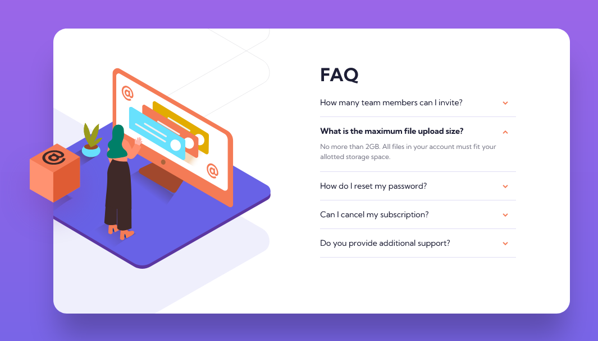

# Frontend Mentor - FAQ accordion card solution

This is a solution to the [FAQ accordion card challenge on Frontend Mentor](https://www.frontendmentor.io/challenges/faq-accordion-card-XlyjD0Oam). Frontend Mentor challenges help you improve your coding skills by building realistic projects. 

## Table of contents

- [Frontend Mentor - FAQ accordion card solution](#frontend-mentor---faq-accordion-card-solution)
  - [Table of contents](#table-of-contents)
  - [Overview](#overview)
    - [The challenge](#the-challenge)
    - [Screenshot](#screenshot)
    - [Links](#links)
  - [My process](#my-process)
    - [Built with](#built-with)
    - [What I learned](#what-i-learned)
    - [Continued development](#continued-development)
    - [Useful resources](#useful-resources)
  - [Author](#author)

## Overview

### The challenge

Users should be able to:

- View the optimal layout for the component depending on their device's screen size
- See hover states for all interactive elements on the page
- Hide/Show the answer to a question when the question is clicked

### Screenshot



### Links

- Solution URL: [https://github.com/adamwozhere/frontend-mentor-challenges/tree/main/faq-accordion-card](https://github.com/adamwozhere/frontend-mentor-challenges/tree/main/faq-accordion-card)
- Live Site URL: [https://adamwozhere.github.io/frontend-mentor-challenges/faq-accordion-card/](https://adamwozhere.github.io/frontend-mentor-challenges/faq-accordion-card/)

## My process

### Built with

- Semantic HTML5 markup
- Progressive enhancement
- CSS custom properties
- Flexbox
- CSS Grid
- Mobile-first workflow
- BEM


### What I learned

I originally looked into creating a css-only accordion using `<input type="checkbox">`'s but then came across some articles about accessibilty and decided on using javascript instead. Accessibilty, ARIA attributes etc. still confuse me sometimes but I tried to implement them to the best of my understanding. I also found Heydon Pickering's article about creating collapsible sections using 'Progressive Enhancement' very interesting, so I tried to implement this so that the accordion is still viewable without javascript.

The basic html structure for the accordion is just `<h2>` tags with a corresponding `<div>` element containing the panel content:

```html
<div class="faq-card__content flow">
  <h1>FAQ</h1>
    <div class="accordion flow" data-component="accordion">
      <h2>How many team members can I invite?</h2>
        <div>
          <p>You can invite up to 2 additional users on the Free plan. There is no limit on
              team members for the Premium plan.</p>
        </div>

        ...

```


The javascript then selects the element via the `data-component="accordion"` attribute, then inserts the html needed to make it work as an accordion component:

```html
<div class="faq-card__content flow">
  <h1>FAQ</h1>
    <div class="accordion flow accordion--enabled" data-component="accordion">
      <h2 class="accordion__heading">
        <button id="accordion-btn-0" ... >
          How many team members can I invite?
          <span><svg class="accordion__arrow" ... ></svg></span>
        </button>
      </h2>
        <div data-component="accordion-panel" ... >
          <p>You can invite up to 2 additional users on the Free plan. There is no limit on
              team members for the Premium plan.</p>
        </div>

        ...

```

This allows the page to render the accordion as just a flow of headings and paragraph elements when javascript is disabled, or fails to load etc. But when it is available the accordion is enhanced fully as an interactive component.


### Continued development

In the future I would look more into accessibility, web components, and making javascript code reusable with classes.

### Useful resources

- [Accessible accordion patterns](https://www.hassellinclusion.com/blog/accessible-accordion-pattern/) - General information about accordion accessibilty, and some links to some implementations below: (Scott O'Hara and Heydon Pickering)
- [Accessible ARIA Accordions](https://www.scottohara.me/blog/2017/10/25/accordion-release.html) - Script source for accordions using ARIA properties (Scott O'Hara)
- [Collapsible Sections](https://inclusive-components.design/collapsible-sections/) - Implementation options using progressive ehancement (Heydon Pickering)
- [Accessible accordion component](https://barker.codes/blog/an-accessible-accordion-component) - This article perhaps helped with a lot of the code and and general understanding through the video guide in the article


## Author

- Website - [Adam Wozniak](https://www.adamwozniak.uk)
- Frontend Mentor - [@adamwozhere](https://www.frontendmentor.io/profile/adamwozhere)
