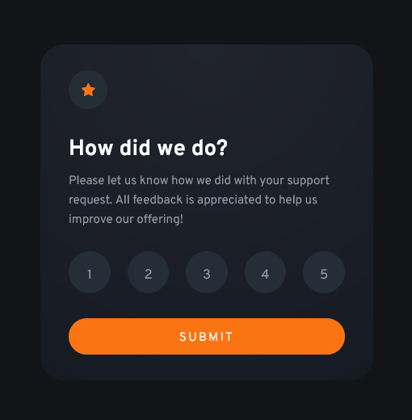

# Frontend Mentor - Interactive rating component solution

This is a solution to the [Interactive rating component challenge on Frontend Mentor](https://www.frontendmentor.io/challenges/interactive-rating-component-koxpeBUmI). Frontend Mentor challenges help you improve your coding skills by building realistic projects. 

## Table of contents

- [Frontend Mentor - Interactive rating component solution](#frontend-mentor---interactive-rating-component-solution)
  - [Table of contents](#table-of-contents)
  - [Overview](#overview)
    - [The challenge](#the-challenge)
    - [Screenshot](#screenshot)
    - [Links](#links)
  - [My process](#my-process)
    - [Built with](#built-with)
    - [What I learned](#what-i-learned)
  - [Author](#author)


## Overview

### The challenge

Users should be able to:

- View the optimal layout for the app depending on their device's screen size
- See hover states for all interactive elements on the page
- Select and submit a number rating
- See the "Thank you" card state after submitting a rating

### Screenshot




### Links

- Solution URL: [https://github.com/adamwozhere/frontend-mentor-challenges/tree/main/interactive-rating-component/](https://github.com/adamwozhere/frontend-mentor-challenges/tree/main/interactive-rating-component/)
- Live Site URL: [https://adamwozhere.github.io/frontend-mentor-challenges/interactive-rating-component/](https://adamwozhere.github.io/frontend-mentor-challenges/interactive-rating-component/)

## My process

### Built with

- Semantic HTML5 markup
- CSS custom properties
- Vanilla JavaScript
- Flexbox
- CSS Grid
- Mobile-first workflow
- CUBE CSS
- Accessibility

### What I learned

With this project I have tried to keep accessibility in mind; although I'm unsure if it is the correct / ideal implementation. The select buttons are a part of a `fieldset` with `role="radiogroup"` and a `legend` that is visually hidden. As the card is a `form`, I included error checking so that if the form is submitted without selecting a rating, then an error message is displayed. I have not looked into fully checking accessibility but I think that the error message would be announced when using a screenreader because of the `role="alert"` attribute:

```html
<strong class="alert" id="error-msg" role="alert" hidden>Select a rating from 1 to 5</strong>
```
This seems like a sensible solution as it means the error message is styled to match the card rather than being a browser-styled popup as with other form inputs / elements.

## Author

- Website - [Adam Wozniak](https://www.adamwozniak.uk)
- Frontend Mentor - [@adamwozhere](https://www.frontendmentor.io/profile/adamwozhere)


