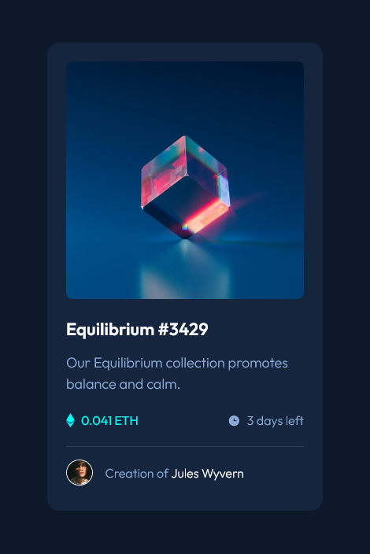

# Frontend Mentor - NFT preview card component solution

This is a solution to the [NFT preview card component challenge on Frontend Mentor](https://www.frontendmentor.io/challenges/nft-preview-card-component-SbdUL_w0U). Frontend Mentor challenges help you improve your coding skills by building realistic projects. 

## Table of contents

- [Frontend Mentor - NFT preview card component solution](#frontend-mentor---nft-preview-card-component-solution)
  - [Table of contents](#table-of-contents)
  - [Overview](#overview)
    - [The challenge](#the-challenge)
    - [Screenshot](#screenshot)
    - [Links](#links)
  - [My process](#my-process)
    - [Built with](#built-with)
    - [What I learned](#what-i-learned)
    - [Continued development](#continued-development)
    - [Useful resources](#useful-resources)
  - [Author](#author)

## Overview

### The challenge

Users should be able to:

- View the optimal layout depending on their device's screen size
- See hover states for interactive elements

### Screenshot



### Links

- Solution URL: [https://github.com/adamwozhere/frontend-mentor-challenges/tree/main/nft-preview-card-component](https://github.com/adamwozhere/frontend-mentor-challenges/tree/main/nft-preview-card-component)
- Live Site URL: [https://adamwozhere.github.io/frontend-mentor-challenges/nft-preview-card-component/](https://adamwozhere.github.io/frontend-mentor-challenges/nft-preview-card-component/)

## My process

I attempted to create this project using semantic HTML and fairly simple css styling, using css custom properties to make code cleaner and more understandable.

### Built with

- Semantic HTML5 markup
- CSS custom properties
- Flexbox
- Mobile-first workflow
- [CUBE CSS](https://cube.fyi/) - CSS methodology

### What I learned

I find semantic HTML quite difficult to determine, as quite often there doesn't seem to be one 'correct' way to impletment something. e.g. for the info section below, I saw this as a list of related information even though there are only two elements.  Perhaps this could be just two `<span>`'s.

```html
<ul class="nft-preview__info row repel">
    <li data-type="price">0.041 ETH</li>
    <li data-type="time-remaining">3 days left</li>
</ul>
```

I'm pleased with the overlay / hover state to the main image. Having implemented it with `::pseudo` elements keeps the html clean, and using both the SVG image and and the cyan colour in one `background:` property seems a simple solution.

```css
.nft-preview__media {
  border-radius: var(--border-radius-sm);
  overflow: hidden;
  cursor: pointer;
  position: relative;
}

.nft-preview__media::after {
  content: "";
  position: absolute;
  inset: 0;
  opacity: 0;
  background: var(--clr-overlay-accent) url(/images/icon-view.svg) no-repeat
    center;
  transition: opacity 200ms ease;
}
```

### Continued development

Front-end development is quite new to me so there is a lot I need to discover and learn.  For future projects I will probably look into using SASS for example.


### Useful resources

- [Andy Bell's modern reset](https://piccalil.li/blog/a-modern-css-reset/) - There's lots of 'css reset' files on the internet but this one I found to be well structured and commented. Also his website has a lot of useful tutorials / information.

## Author

- Website - [Adam Wozniak](https://www.adamwozniak.uk)
- Frontend Mentor - [@adamwozhere](https://www.frontendmentor.io/profile/adamwozhere)

