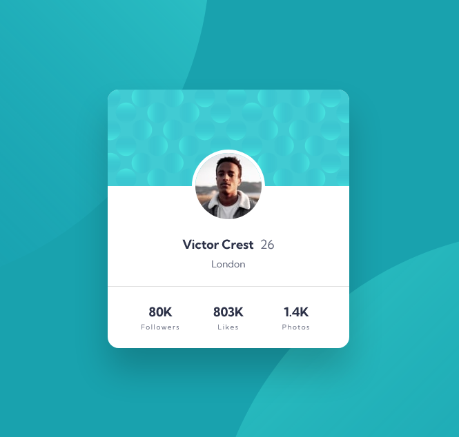

# Frontend Mentor - Profile card component solution

This is a solution to the [Profile card component challenge on Frontend Mentor](https://www.frontendmentor.io/challenges/profile-card-component-cfArpWshJ). Frontend Mentor challenges help you improve your coding skills by building realistic projects. 

## Table of contents

- [Frontend Mentor - Profile card component solution](#frontend-mentor---profile-card-component-solution)
  - [Table of contents](#table-of-contents)
  - [Overview](#overview)
    - [The challenge](#the-challenge)
    - [Screenshot](#screenshot)
    - [Links](#links)
  - [My process](#my-process)
    - [Built with](#built-with)
    - [What I learned](#what-i-learned)
  - [Author](#author)

## Overview

### The challenge

- Build out the project to the designs provided

### Screenshot

### Links

- Solution URL: [https://github.com/adamwozhere/frontend-mentor-challenges/tree/main/profile-card-component/](https://github.com/adamwozhere/frontend-mentor-challenges/tree/main/profile-card-component/)
- Live Site URL: [https://adamwozhere.github.io/frontend-mentor-challenges/profile-card-component](https://adamwozhere.github.io/frontend-mentor-challenges/profile-card-component/)

## My process

### Built with

- Semantic HTML5 markup
- CSS custom properties
- CSS Grid
- Mobile-first workflow
- BEM CSS

### What I learned

The main challenge I found with this project was with the background pattern elements: I learnt how to use multiple backgrounds and position them correctly for the the desktop design; but they don't quite match up for the mobile view. I'm unsure if there is a better way of implementing this so that the patterns move dynamically so that they line up correctly for mobile, or if this is simply not possible. However I think the mobile view still looks suitable.

## Author

- Website - [Adam Wozniak](https://www.adamwozniak.uk)
- Frontend Mentor - [@adamwozhere](https://www.frontendmentor.io/profile/adamwozhere)
