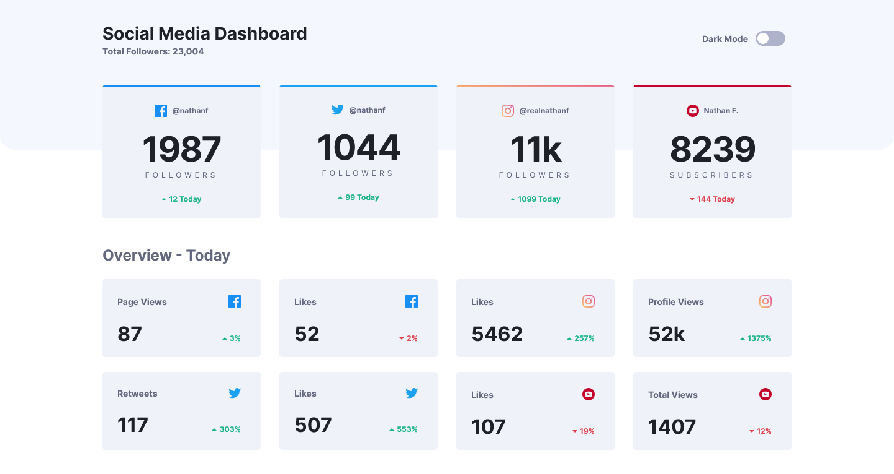

# Frontend Mentor - Social media dashboard with theme switcher solution

This is a solution to the [Social media dashboard with theme switcher challenge on Frontend Mentor](https://www.frontendmentor.io/challenges/social-media-dashboard-with-theme-switcher-6oY8ozp_H). Frontend Mentor challenges help you improve your coding skills by building realistic projects. 

## Table of contents

- [Frontend Mentor - Social media dashboard with theme switcher solution](#frontend-mentor---social-media-dashboard-with-theme-switcher-solution)
  - [Table of contents](#table-of-contents)
  - [Overview](#overview)
    - [The challenge](#the-challenge)
    - [Screenshot](#screenshot)
    - [Links](#links)
  - [My process](#my-process)
    - [Built with](#built-with)
    - [What I learned](#what-i-learned)
    - [Useful resources](#useful-resources)
  - [Author](#author)

## Overview

### The challenge

Users should be able to:

- View the optimal layout for the site depending on their device's screen size
- See hover states for all interactive elements on the page
- Toggle color theme to their preference

### Screenshot

### Links

- Solution URL: [https://github.com/adamwozhere/frontend-mentor-challenges/tree/main/social-media-dashboard](https://github.com/adamwozhere/frontend-mentor-challenges/tree/main/social-media-dashboard/)
- Live Site URL: [https://adamwozhere.github.io/frontend-mentor-challenges/social-media-dashboard/](https://adamwozhere.github.io/frontend-mentor-challenges/social-media-dashboard/)

## My process

### Built with

- Semantic HTML5 markup
- CSS custom properties
- Flexbox
- CSS Grid
- Mobile-first workflow
- CUBE CSS

### What I learned

This project provided more of a challenge with learning javascript and also CSS grid. I found some of the styling particulary difficult as there are a lot of changes to colours between the light and dark mode - I need to improve my token-naming conventions to make code cleaner and more understandable. While functional; the theme toggle defaults to light - in the future I'd like to implement it so that it defaults to system default or a setting saved to local storage if the site has been visited before.

I attempted to implement accessibilty with visually hidden titles and a focus state to the toggle switch, however; I think a better approach may be to hide the majority of the page and provide all the information as a table for screen-readers only.

### Useful resources

- [a11yproject.com](https://www.a11yproject.com/posts/how-to-hide-content/) - This provided me with a visually-hidden class to hide titles but keep them accessible
- [carbondesignsystem.com](https://carbondesignsystem.com/components/toggle/usage/) - I adapted this code for creating the toggle switch

## Author

- Website - [Adam Wozniak](https://www.adamwozniak.uk)
- Frontend Mentor - [@adamwozhere](https://www.frontendmentor.io/profile/adamwozhere)
