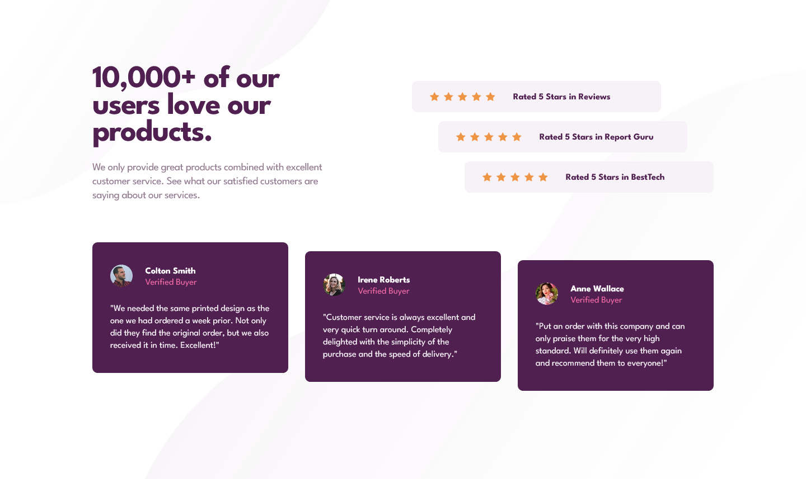

# Frontend Mentor - Social proof section solution

This is a solution to the [Social proof section challenge on Frontend Mentor](https://www.frontendmentor.io/challenges/social-proof-section-6e0qTv_bA). Frontend Mentor challenges help you improve your coding skills by building realistic projects. 

## Table of contents

- [Frontend Mentor - Social proof section solution](#frontend-mentor---social-proof-section-solution)
  - [Table of contents](#table-of-contents)
  - [Overview](#overview)
    - [The challenge](#the-challenge)
    - [Screenshot](#screenshot)
    - [Links](#links)
  - [My process](#my-process)
    - [Built with](#built-with)
    - [What I learned](#what-i-learned)
    - [Useful resources](#useful-resources)
  - [Author](#author)

**Note: Delete this note and update the table of contents based on what sections you keep.**

## Overview

### The challenge

Users should be able to:

- View the optimal layout for the section depending on their device's screen size

### Screenshot




### Links

- Solution URL: [https://github.com/adamwozhere/frontend-mentor-challenges/tree/main/social-proof-section/](https://github.com/adamwozhere/frontend-mentor-challenges/tree/main/social-proof-section/)
- Live Site URL: [https://adamwozhere.github.io/frontend-mentor-challenges/social-proof-section](https://adamwozhere.github.io/frontend-mentor-challenges/social-proof-section)

## My process

### Built with

- Semantic HTML5 markup
- CSS custom properties
- Flexbox
- Fluid type
- Mobile-first workflow
- CUBE CSS

### What I learned

I learned a bit about `figure`, `blockquote` and `figcaption` with this project, and attempted to use them semantically; there seems to be varying thoughts on best-practice but I think this implementation is ok.

I had a little difficulty with aligning the text in some of the elements (`.ratings` and `.testimonial figcaption`'s) as the font baseline seems to be a little too high; centering the text vertically using `flex align-items center` seemed to not look right visually. I researched the `@font-face ascent-override` property to solve this but it does not yet have full browser support. Instead I decided to use a helper class to achieve this - it is added to an html element when needed, then using the `--ascent-override` variable it can be adjusted via the respective block / component if necessary. 

```css
/* ascent-override does not work in safari, so apply as a class to adjust line-box position */
.text\:ascent-override {
    position: relative;
    bottom: var(--ascent-override, 0);
}

```


### Useful resources

- [Fluid-responsive font-size calculator](https://websemantics.uk/tools/responsive-font-calculator/) - I used this website to generate the css for the fluid type for the heading in the mobile view.
- [Ascent-override](https://developer.mozilla.org/en-US/docs/Web/CSS/@font-face/ascent-override) - An explanation on MDN about the ascent of a font above the baseline.

## Author

- Website - [Adam Wozniak](https://www.adamwozniak.uk)
- Frontend Mentor - [@adamwozhere](https://www.frontendmentor.io/profile/adamwozhere)