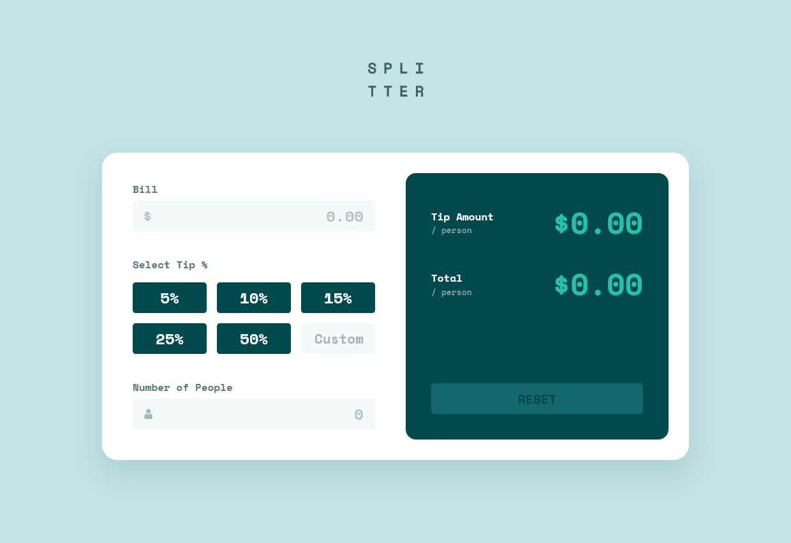

# Frontend Mentor - Tip calculator app solution

This is a solution to the [Tip calculator app challenge on Frontend Mentor](https://www.frontendmentor.io/challenges/tip-calculator-app-ugJNGbJUX). Frontend Mentor challenges help you improve your coding skills by building realistic projects.

## Table of contents

- [Frontend Mentor - Tip calculator app solution](#frontend-mentor---tip-calculator-app-solution)
  - [Table of contents](#table-of-contents)
  - [Overview](#overview)
    - [The challenge](#the-challenge)
    - [Screenshot](#screenshot)
    - [Links](#links)
  - [My process](#my-process)
    - [Built with](#built-with)
    - [What I learned](#what-i-learned)
      - [Currency (Bill) Input](#currency-bill-input)
      - [Integer (Number of Persons) Input](#integer-number-of-persons-input)
      - [Percentage (Custom tip) Input](#percentage-custom-tip-input)
  - [Author](#author)

## Overview

### The challenge

Users should be able to:

- View the optimal layout for the app depending on their device's screen size
- See hover states for all interactive elements on the page
- Calculate the correct tip and total cost of the bill per person

### Screenshot

### Links

- Solution URL: [https://github.com/adamwozhere/frontend-mentor-challenges/tree/main/tip-calculator-app/](https://github.com/adamwozhere/frontend-mentor-challenges/tree/main/tip-calculator-app/)
- Live Site URL: [https://adamwozhere.github.io/frontend-mentor-challenges/tip-calculator-app/](https://adamwozhere.github.io/frontend-mentor-challenges/tip-calculator-app/)

## My process

### Built with

- Semantic HTML5 markup
- CSS custom properties
- Flexbox
- CSS Grid
- CUBE CSS
- Mobile-first workflow
- Client-side input validation

### What I learned

This project was surprisingly difficult because of the radio group and custom input formatting. I'm not sure if there is a best practice for implementing this type of radio group; where a text input is effectively a radio button also. Perhaps there is a better way of handling this but I used an extra hidden radio button with the value `custom` -- then in the JS file, if the radio group value is `custom` then it will calculate the bill using the value of the custom tip input instead.

I also decided to live-format / validate the inputs which complicated things. I found it quite difficult and so my JS file became like spaghetti quite quickly. I think a better approach would be to use Web Components or a JS framework to compartmentalise the input components better and handle state. However it does function, and I learnt a lot by attempting this.

For the custom input formatting, I implemented the following:

#### Currency (Bill) Input ####
- allows only numbers to be input, always starting from the first digit
- cursor is always set to the end (the user cannot select and input numbers in the middle of a value)
- automatically formats as a currency on keydown (including decimal symbols etc.)

This forces the mode of input, stopping the user from entering strange numbers such as multiple leading zeros or decimal symbols / separators in strange places such as: `00000.123,456.0.0.00`.

e.g. To input the formatted number `123,000.50`, the user inputs `12300050` using only the number keys (backspace can be used to edit the number if needed.) However the user can input the decimal symbols / separators `, .` as they will be ignored, but still formatted on keydown.

#### Integer (Number of Persons) Input ####

The same as the currency input, except there are no decimals (forcing integers only).

#### Percentage (Custom tip) Input ####

The same as the integer input, except: 
- automatic formatting of the `%` symbol (focus sets cursor to just before the symbol instead of after)
- number limited to `0 - 100`
- if the input is selected but left blank, it will format to `0%` on losing focus
- if the input is set to `0%` then re-selected, it is formatted back to `%` so the user does not have to delete the leading `0` before entering a new value
  
## Author

- Website - [Adam Wozniak](https://www.adamwozniak.uk)
- Frontend Mentor - [@adamwozhere](https://www.frontendmentor.io/profile/adamwozhere)
